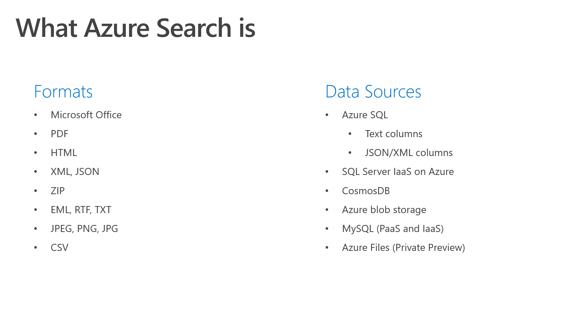
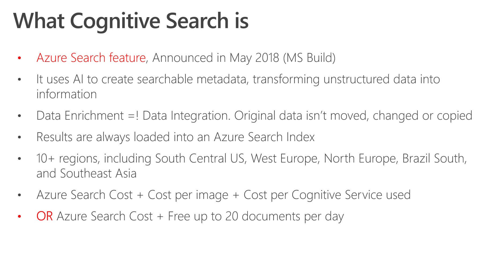
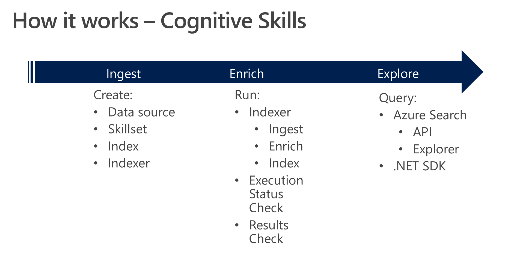
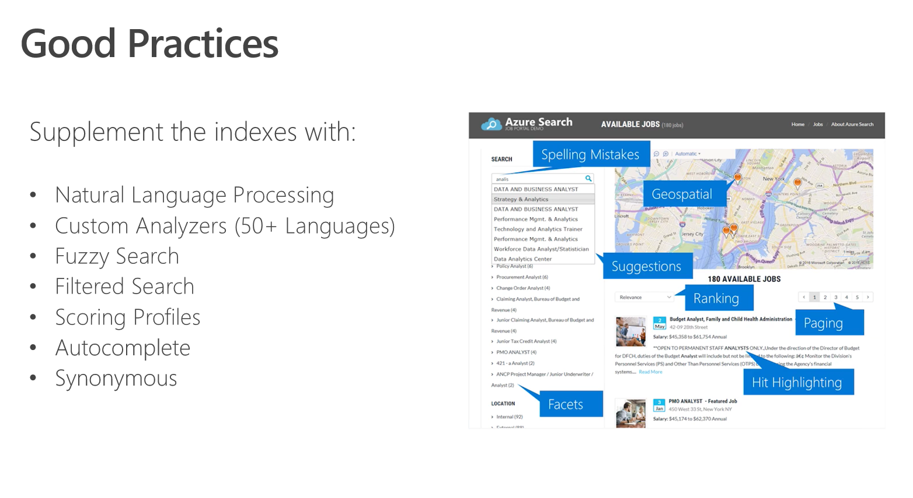
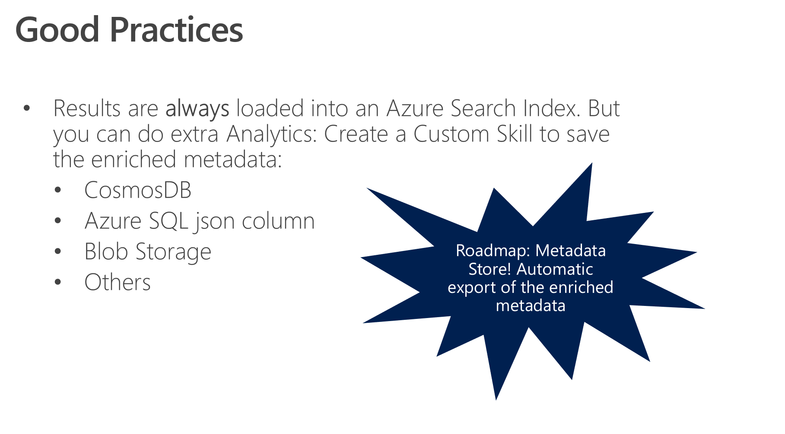
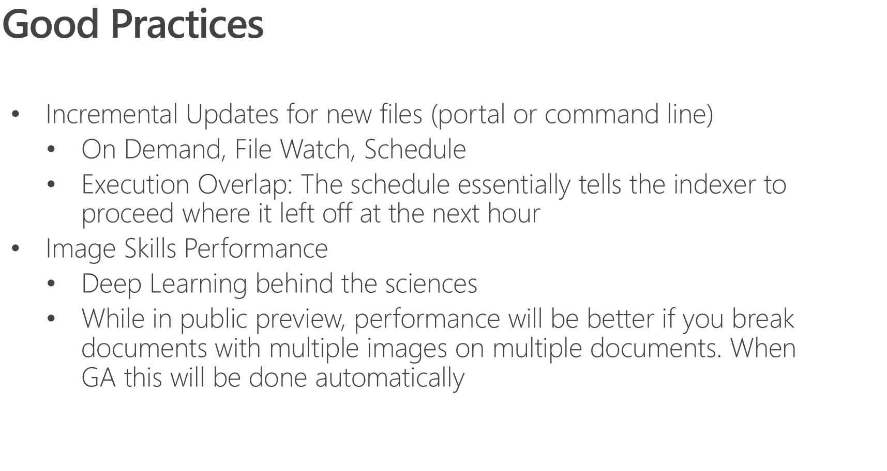
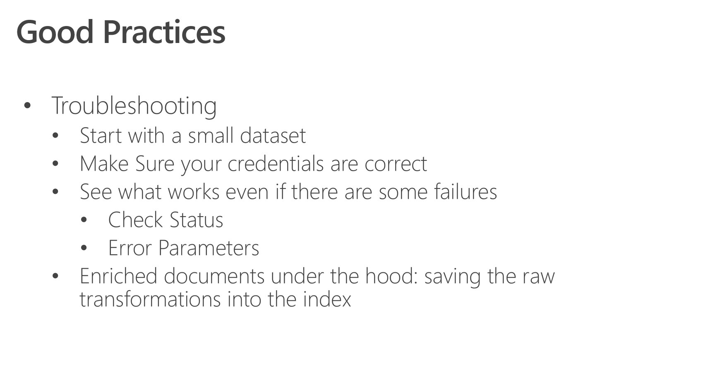

***

***

***

***

***

***

***

***

***

***

***

***

***

***

***

***

***

***

***

***

***

***

***

***

***

***

***

***

***

***

***

***

***

***

***

***
## Next Step
[Environment Creation](./Environment-Creation.md) or [Back to Labs Menu](./readme.md)