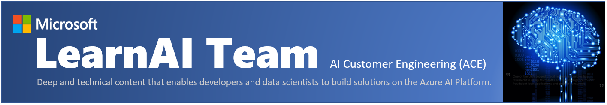

# Knowledge Mining

## Knowledge Mining Bootcamp - Build a Cognitive Search Solution for business documents using Microsoft AI Platform

## About this course

In this course, you will create an enterprise search solution by applying knowledge mining to business documents like contracts, memos, presentations and images. You will use Microsoft Azure AI technology to extract insights from unstructured data and expose the results in a Bot interface. This training is two days, but you can compress the duration with [alternative agendas](./resources/md-files/alternative-agendas.md).

## Goals

At the end of this training you will have learned:

+ **What** Azure Cognitive Search is
+ **How** to implement a Cognitive Search Solution
+ **Why** this technology can be useful for any company
+ **When** to use this solution for demos, POCs and other business scenarios

The hands-on labs will teach you how to use Microsoft Azure Search combined with Microsoft Cognitive Services for entity recognition, image analysis, text translation and indexed search on enterprise business documents. This approach uses Artificial Intelligence to create an advanced search experience.

While this course focuses on Azure Cognitive Search capabilities, an in-depth course on building Bots and integrating various Azure Cognitive Services is available here - [Azure Cognitive Services Bootcamp](https://azure.github.io/LearnAI-Bootcamp/emergingaidev_bootcamp).

In this course we will cover these key concepts:

1. Fundamentals of Azure Search and its capabilities

1. Microsoft Cognitive Search and its key business scenarios

1. Building an enrichment data pipeline for search using predefined and custom skillsets:

    + Text skills like entity recognition, language detection, text manipulation and key phrase extraction
    + Image skills like OCR
    + Content moderation skills to detect documents with incompliant content

1. Use the enriched data for an advanced search experience for business documents within an enterprise.

1. Expose the knowledge mining solution using a bot interface for document search and consumption.

### Architecture

### Technologies Covered

### Industry application

Intelligent search is relevant to many major industries. Some are listed below.

1. Retail and health care industries employ chatbots with advanced multi-language support capabilities to service their customers.

1. Retail, Housing and Automotive industries for sales/listing.

1. Law firms and legal departments can use this technology to enforce compliance or improve search capabilities.

### Pre-requisites

1. Fundamental working knowledge of Azure Portal, Azure Functions and Azure Search
1. Familiarity with Visual Studio and minimum C# knowledge
1. Familiarity with Azure Bots and Microsoft Bot Framework v4
1. Familiarity with [Postman](https://www.getpostman.com/)

If you do not have any of the above pre-requisites, please find below links

1. *To Read (10 minutes):* [Visual Studio Tutorial](https://docs.microsoft.com/en-us/visualstudio/ide/visual-studio-ide)
1. *To Read (8 minutes):* [Azure Bot Service Overview](https://docs.microsoft.com/en-us/azure/bot-service/bot-service-overview-introduction?view=azure-bot-service-4.0)
1. *To Read (4 minutes):* [Azure Functions Overview](https://docs.microsoft.com/en-us/azure/azure-functions/functions-overview)  
1. *To Read (10 minutes):* [Azure Search Overview](https://docs.microsoft.com/en-us/azure/search/search-what-is-azure-search)
1. *To Read (7 minutes):* [Postman Tutorial](https://docs.microsoft.com/en-us/azure/search/search-fiddler)
1. *To Do (30 minutes):* [C# Quickstart](https://docs.microsoft.com/en-us/dotnet/csharp/quick-starts/)

### Pre-Setup before you attend the class Mandatory

1. *To Create:* You need a Microsoft Azure account to create the services we use in our solution. You can create a [free account](https://azure.microsoft.com/en-us/free/), use your MSDN account or any other subscription where you have permission to create services
1. *To Install:* [Visual Studio 2017](https://www.visualstudio.com/vs/) version 15.5 or later, *including the Azure development workload*
1. *To Install:* [Postman](https://www.getpostman.com/). To call the labs APIs
1. *To Install:* [Bot Emulator](https://github.com/Microsoft/BotFramework-Emulator/releases), use the '.exe' file from release 4.1.0 or newer
1. *To Install:* [Git for Windows](https://gitforwindows.org/) or any other git app you prefer

### Course Details

Primary Audience: Azure AI Developers, Solution Architects.
Secondary Audience:  Any professional interested in learning AI.

### Level

This content is designed as an intermediate to advanced level course for AI developers and/or architects.

### Type

This course, in its full form, is designed to be taught in-person but you can also use the materials in a self-paced fashion. There are assignments and multiple reference links throughout the materials that support the concepts and skills you will learn.

### Length

Full Course classroom training:  16 hours

### Related LearnAI Courses

[Azure Cognitive Services Bootcamp](https://azure.github.io/LearnAI-Bootcamp/emergingaidev_bootcamp)  
[Cognitive Search Workshop](https://azure.github.io/LearnAI-Cognitive-Search/)  
[Designing and Architecting Intelligent Agents](https://azure.github.io/LearnAI-DesigningandArchitectingIntelligentAgents/)  

### Course Modules

1. [Introduction](./resources/md-files/introduction.md) – **Presentation** overview of Azure Search, Cognitive Search, business scenarios and industry specific applications.

1. [Architecture](./resources/md-files/solution-architecture.md) – **Solution Architecture** for building enterprise search solution.

1. [Lab 1](./labs/lab-environment-creation.md) - Azure - **Environment Creation**

1. [Lab 2](./labs/lab-azure-search.md) - Azure Search - **Indexing Blob Storage**

1. [Lab 3](./labs/lab-text-skills.md) - Cognitive Search – **Text Skills**

1. [Lab 4](./labs/lab-image-skills.md) - Cognitive Search – **Image Skills**

1. [Lab 5](./labs/lab-custom-skills.md) - Cognitive Search – **Custom Skills**

1. [Lab 6](./labs/lab-bot-business-documents.md) - Build and Integrate a **Bot** with Cognitive Search API

1. [Lab 7](./labs/lab-final-case.md) - **Architecture Design Session**

> Note: Once you've completed the labs, we recommend deleting the resource group (and all the resources in it) to avoid incurring extra charges.

## Contact

Contact us: LearnAI@microsoft.com and <http://aka.ms/LearnAI-GitHub>

## Certifications

The LearnAI team had intense participation in the creation of the following new Microsoft certifications:

- Azure Data Engineer​
  - DP-200: Implementing an Azure Data Solution ​
  - 80% off discount code thru Mar 12, 2019: DP200BigTrips​
  - DP-201: Designing an Azure Data Solutions​
  - 80% off discount code thru Mar 12, 2019: DP201Walks​

- Azure AI Engineer​
  - AI-100: Designing and Implementing an Azure AI Solution ​
  - 80% off discount code thru Mar 5, 2019: AI100Goals​

- Azure Data Scientist ​
  - DP-100: Designing and Implementing a Data Science Solution on Azure​
  - 80% off discount code thru Mar 7, 2010: DP100KLS​

### Q&A and Survey

Please help the LearnAI Team with [questions and feedback](./resources/md-files/qa-feedback-survey.md) about this training.