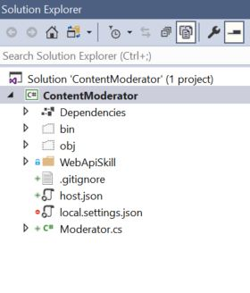
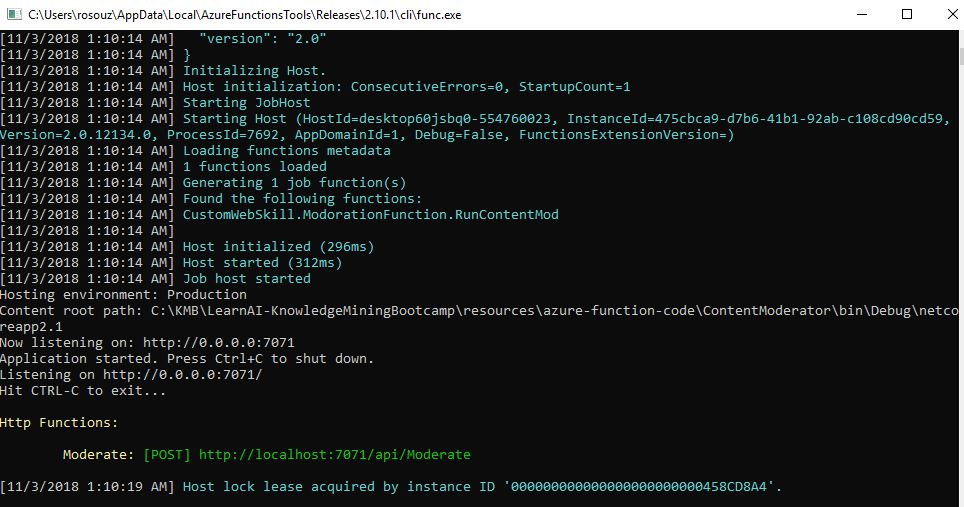

# Create a Cognitive Search Skillset with **Custom** Skills

In this lab, you will learn [how to create a Custom Skill](https://docs.microsoft.com/en-us/azure/search/cognitive-search-custom-skill-interface)
and integrate it into the enrichment pipeline. Custom skills allow you to add any REST API transformation to the dataset, also feeding other transformations within the pipeline, if required.

You will use an [Azure Function](https://azure.microsoft.com/services/functions/) to wrap the [Content Moderator API](https://azure.microsoft.com/en-us/services/cognitive-services/content-moderator/) and detect incompliant documents in the dataset.

The Azure Content Moderator API is a cognitive service that checks **text, image, and video** content for material that is potentially offensive, risky, or otherwise undesirable. 
When such material is found, the service applies appropriate labels (flags) to the content. Your app can then handle flagged content in order to comply with regulations or maintain the intended environment for users. 
See the [Content Moderator APIs](https://docs.microsoft.com/en-us/azure/cognitive-services/content-moderator/overview#content-moderator-apis) section to learn more about what the different content flags indicate.

This API offers:

+ Text moderation: Scans text for offensive content, sexually explicit or suggestive content, profanity, and personally identifiable information (PII). **That's what you will use in this lab**.
+ Custom term lists: Scans text against a custom list of terms in addition to the built-in terms. Use custom lists to block or allow content according to your own content policies.
+ Image moderation: Scans images for adult or racy content, detects text in images with the Optical Character Recognition (OCR) capability, and detects faces.
+ Custom image lists: Scans images against a custom list of images. Use custom image lists to filter out instances of commonly recurring content that you don't want to classify again.
+ Video moderation: Scans videos for adult or racy content and returns time markers for said content.
+ Review: Use the Jobs, Reviews, and Workflow operations to create and automate human-in-the-loop workflows with the human review tool. The Workflow API is not yet available through the .NET SDK.

Content Moderator’s machine-assisted **text moderation** response includes the following information:

+ Profanity: term-based matching with built-in list of profane terms in various languages
+ Classification: machine-assisted classification into three categories
+ Personally Identifiable Information (PII)
+ Auto-corrected text
+ Original text
 
>IMPORTANT: This Azure Function output is **Edm.String**, but this lab converts it to a boolen information: if the document has moderated content or not.

Content Moderator API also has a tool for human review of the moderation. For more information, click [here](https://docs.microsoft.com/en-us/azure/cognitive-services/content-moderator/review-tool-user-guide/human-in-the-loop
).

## Step 1 - Content Moderator API

Use the [Azure Portal](https://ms.portal.azure.com) to create a Content Moderator API, using the name you want, the same location of the Azure Search service and the S0 pricing tier. We can't use the free tier since it only allows 1 TPS (transaction per second). You should also save the keys and the endpoint, for later use in this lab.

To see how the API works, and also to learn how to demo this technology in minutes, navigate to the [Content Moderator Text API console](https://docs.microsoft.com/en-us/azure/cognitive-services/content-moderator/try-text-api). Read the whole page, it should take you about four minutes. When you are done, scroll all the way up and click the first link on the page, [Text Moderation API](https://westus.dev.cognitive.microsoft.com/docs/services/57cf753a3f9b070c105bd2c1/operations/57cf753a3f9b070868a1f66f). It will open a control panel for Cognitive Services, as you can see in the image below.


Now, clicking the blue buttons, choose the region where you created your Content Moderator API, that should be the same region you are using for all services in this training. Now set the values as listed below:

### Query parameters

+ autocorrect = true
+ PII = true
+ listId = remove parameter (we don't have a list of prohibited terms to work with at this point)
+ classify = true
+ language = eng (The default example is in English)

### Headers

+ Keep Content-Type as "text/plain"
+ Paste in your Content Moderator API key

Now you are ready to test the API you created on Azure Portal. Scroll down and check the suggested text in "Request body" section. It has PIIs like email, phone number, physical and IP addresses. It also has a profanity word. Scroll until the end of the page and click the blue "Send" button. The expected results are:

+ Response Status = 200 OK
+ Response Latency <= 1000 ms
+ Response content with a json file where you can read all of the detected problems. The "Index" field indicates the position of the term within the submitted text.

## Step 2 - Visual Studio

Visual Studio has [Tools for AI](https://visualstudio.microsoft.com/downloads/ai-tools-vs/) but you don't need it for this training since they are used to **create** custom AI projects, while in this training you are **using** AI through Azure Cognitive Search and Services.

### Step 2.1 - Checking Versions

Open your Visual Studio and click "Help / About Microsoft Visual Studio" on the main menu. You can try to use different versions, especially newer versions. But this training was created using the environment below and It is strongly recommended that you use the same versions. Please check if your system matches this versions:

+ Visual Studio version 15.8.9
+ Microsoft .Net Framework version 4.7.03056
+ Azure Functions and Web Jobs Tools - 15.9.02046.0


If your Azure Functions Tools don't match, follow [this](https://docs.microsoft.com/en-us/visualstudio/extensibility/how-to-update-a-visual-studio-extension?view=vs-2017) procedure to update it.

If your Visual Studio version doesn't match, click "Help / Check for Updates" and follow the instructions.

If your .Net Framework version doesn't match, [download](https://www.microsoft.com/net/download) and install the last version.

There is another method to find the required Visual Studio and Azure Functions updates: Just click the yellow flag on the upper right corner of your Visual Studio, as you can see in the image below.


### Step 2.2 - Preparing the solution

Open the Windows Explorer and find the folder **resources/code-azure-function** where you cloned this repository. You need to locate the file CognitiveSkill.sln. There should be a CognitiveSkill folder in the same folder where you found the .sln file.

Double click, or hit enter, on the .sln file to open it in Visual Studio. Check your Solution Explorer on the right and confirm that you can see the same structure of the image below.



In the image below you can see very important aspects of the code you are about to edit:

1. In the first red square you can see the code testing the return of the Content Moderator API for Personal Identifiable Information (PII). The code will return if the documents of the dataset have PII or not.

1. The second red area highlights the "text" label. You will need to use this label in the skillset definition of this lab, in one of the next steps.

1. The other 3 read areas indicate where you need to edit the code, what will be explained right after the image, within this step of the lab.


>Note! This is not a C# training and this Azure Function application is a way to add the custom skill to the enrichment pipeline. Please note that good practices are not 100% used in the code (e.g. the key wide open and fixed in the code). For enterprise grade solutions, this code should be adapted to all good practices, business and security requirements.

Click on the Moderation.cs file on the Solution Explorer, it should open in the main window of your Visual Studio. Get familiar with the "using session", to learn which packages are used. Scroll down until the three "TO DO - Action Required" sessions of the code.

Follow the instructions of the three "TO-DO" sections:

+ If necessary change "southcentralus" in the uriPrefix URL. This is the same endpoint of the first step of this lab
+ Add your key. This is the same key of the first step of this lab
+ If necessary, change the host url with the same endpoint of the first step of this lab, but without `https://` and without `/contentmoderator`

>Note! Our dataset has a text file with PII, in english. That's why we are only testing this capability, to enforce this regulation within the business documents. This simple usage was defined to keep the training simple. For advanced scenarios, you can use all other Content Moderator capabilities.

## Step 3 - Test the function from Visual Studio

Press **F5** or click the green arrow on the "ContentModerator" button to run the solution. you should expect a "cmd" window with some information and the local URL of the endpoint in the end of the log, like you can see in the image below.



Now use Postman, without any information in headers tab, to issue a call like the one shown below:

```http
POST http://localhost:7071/api/ContentModerator
```

### Request body

```json
{
   "values": [
        {
            "recordId": "a1",
            "data":
            {
               "text":  "Email: abcdef@abcd.com, phone: 6657789887, IP: 255.255.255.255, 1 Microsoft Way, Redmond, WA 98052"
            }
        }
   ]
}
```

### Response

You should see a response similar to the following example:

```json
{
    "Values": [
        {
            "RecordId": "a1",
            "Data": {
                "text": true
            },
            "Errors": [],
            "Warnings": []
        }
    ]
}
```

Close down the Azure Function CLI window to stop debugging.

## Step 4 - Publish the function to Azure

When you are satisfied with the function behavior, you can publish it.

1. In **Solution Explorer**, right-click the project and select **Publish**. Choose **Create New** > **Publish**.

2. If you haven't already connected Visual Studio to your Azure account, select **Add an account....**

3. Follow the on-screen prompts. You are asked to specify the Azure account, the resource group, the hosting plan, and the storage account you want to use. You will have the option to create a new resource group (or use the one you've already created for these labs), a new hosting plan, and a storage account if you don't already have one in your Azure Account. When finished, select **Create**.

4. After the deployment is complete, note the Site URL. It is the address of your function app in Azure.

5. In the [Azure portal](https://portal.azure.com), navigate to the Resource Group, and look for the Content Moderator Function you published. Under the **Manage** section, you should see Host Keys. Select the **Copy** icon for the *default* host key.  

## Step 5 - Test the function in Azure

Now that you have the default host key, use Postman to test your function as follows:

```http
POST https://[your-function-name].azurewebsites.net/api/ContentModerator?code=[enter your Azure Functions key here]
```

### Request Body

```json
{
   "values": [
        {
            "recordId": "a1",
            "data":
            {
               "text":  "Email: abcdef@abcd.com, phone: 6657789887, IP: 255.255.255.255, 1 Microsoft Way, Redmond, WA 98052"
            }
        }
   ]
}
```

This should produce a similar result to the one you saw previously when running the function in the local environment.

## Step 6 - Cleaning the environment again

Let's do the same cleaning process of the previous lab. Save all scripts (API calls) you did until here, including the definition json files you used in the "body" field.

You can use Azure Portal or API calls to do the required deletes:

1. [Deleting the indexer - API call](https://docs.microsoft.com/en-us/rest/api/searchservice/delete-indexer) - Just use your service, key and indexer name
1. [Deleting the index](https://docs.microsoft.com/en-us/rest/api/searchservice/delete-index) - Just use your service, key and indexer name
1. [Deleting the Skillset](https://docs.microsoft.com/en-us/rest/api/searchservice/delete-skillset) - Just use your service, key and skillset name

Status code 204 is returned on a successful deletion.

## Step 7 - Connect to your Pipeline, recreating the environment

Now let's use the [official documentation](https://docs.microsoft.com/en-us/azure/search/cognitive-search-custom-skill-interface) to learn the syntax we need to add the custom skill to our enrichment pipeline.

As you can see, the custom skill works like all other predefined skills, but the type is **WebApiSkill** and you need to specify the URL you created above. The example below shows you how to call the skill. Because the skill doesn't handle batches,
you have to add an instruction for maximum batch size to be just ```1``` to send documents one at a time. The objectives are:

1. Save the extracted boolean value for moderation in a new index field
1. Also submit the OCR text to the content moderator API
1. Keep the OCR text been submited to Entity, Language and Key Phrases extractions

```json
      {
        "@odata.type": "#Microsoft.Skills.Custom.WebApiSkill",
        "description": "Our new content moderator custom skill",
        "uri": "https://[your-function-name].azurewebsites.net/api/ContentModerator?code=[enter default host key here]",
        "batchSize":1,
        "context": "/document",
        "inputs": [
          {
            "name": "text",
            "source": "/document/content"
          }
        ],
        "outputs": [
          {
            "name": "text",
            "targetName": "needsModeration"
          }
        ]
      }

```

### Step 7.1 - Challenge

As you can see, again we are not giving you the body request. One more time you can use the previous lab as a reference.  
Skipping the services and the data source creation, repeat the other steps of the previous labs, in the same order. Name the new field of the content moderation process as **needsModeration**. It is case sensitive, so it is important to use the same name formation. If you decide to use a different name, you will need to change the Bot code to make it work.

>Note! Please make sure you will create the new index field for the moderation analysis as boolean. More information [here](https://docs.microsoft.com/en-us/azure/search/search-what-is-an-index).

1. ~~Create the services at the portal~~ **Not required, we did not delete it**.
2. ~~Create the Data Source~~ **Not required, we did not delete it**.
3. Recreate the Skillset
4. Recreate the Index
5. Recreate the Indexer
6. Check Indexer Status - Check the moderation results.  
7. Check the Index Fields - Check the moderated text new field.
8. Check the data - If you don't see the moderated data, something went wrong. Select only the needsModeration and the blob_uri fields

## Step 8

Now we have our data enriched with pre-defined and custom skills. Use the Search Explorer within your Azure Search service in the Azure Portal to query the data. Create 2 or more queries to identify documents with compliance issues, the moderated documents.


## Step 9 - Optional

Here is another challenge for you. Use [this](https://docs.microsoft.com/en-us/azure/search/cognitive-search-create-custom-skill-example) documentation as a reference and:

1. Create and publish another Azure Function, for the Translation API
1. Connect this new API into your Enrichment Pipeline skillset
1. Create a new skill field for the translated text into the index
1. Create another mapping in your indexer
1. Use Postman or Azure Search Explorer to check the translated data.

## Finished Solution

If you could not make it, [here](../resources/finished-solutions/finished-solution-lab-custom-skills.md) is the challenge solution. You just need to follow the steps. **Step 9 isn't included.**

## Next Step

[Business Documents Bot Lab](../labs/lab-bot-business-documents.md) or
[Back to Read Me](../README.md)
