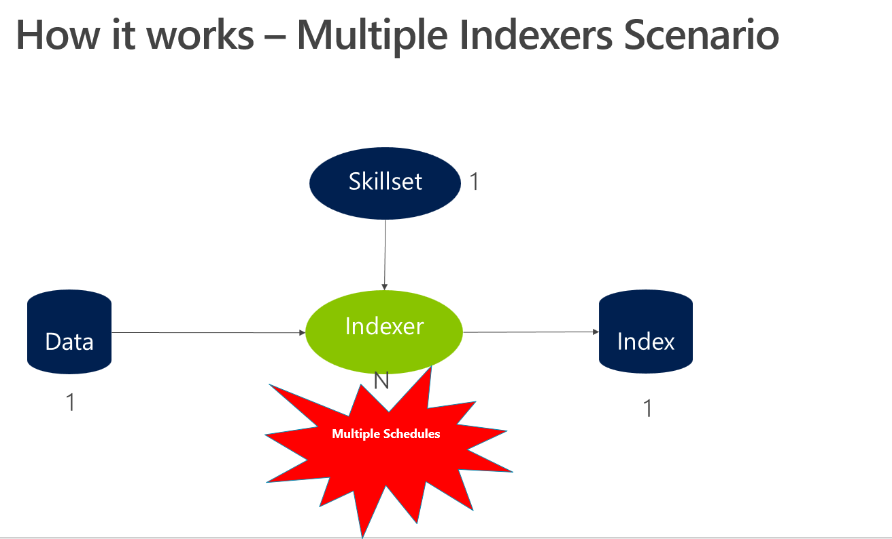

# Final Case

## Objective

> Note: This activity was designed as a group exercise for in-classroom ILTs (Instructor Lead Trainings), the idea is a final discussion after the exercise. But you also can do it if by yourself.

## Complex Scenarios

Now you are very familiar to 1x1x1x1 scenarios: one dataset, one index, one skillset and one indexer. The diagrams below describe this situation but also complex scenarios of Cognitive Search.

## Case Study

Contoso Vineyard is a relatively new vineyard that is gaining popularity quickly due to several factors. One reason is that Contoso Vineyard operates on a monthly subscription model, with progressive discounts.
The company has an  award-winning customer service, what helped the business growth in South America countries. While Gold subscribers can chat with sommeliers to customize the next wine delivery, Silver clients can chat with intelligent bots to customize their options.

Now the company needs to increase their search capabilities, for channels like chat, web portal and mobile Application. Contoso Vineyard needs to enrich and index their product catalog to increase accuracy of clients and sommeliers searches. The product catalog is a series of HTML, Microsoft Word and PDFs documents. Some of them have images and they are all written in English, which is a problem for their Latin America clients.

They also want to provide links for places, grapes and other entities their data has. The company owner and the Master Sommelier are famous figures and the marketing department wants to highlight this as well.

## Exercise

Using what you've learned throughout the course, develop a potential Cognitive Search enrichment pipeline to help the company achieve their search business goals. The expected outputs of this exercise are:

1. Detail a solution using one of the complex scenarios listed above: why e how. A Diagram is better, hand made is ok
1. List of the predefined and custom skills
1. The skills sequence and how they are integrated
1. The necessary Azure Search tier for this solution

## Cleaning your environment - Again

You have completed all of the hands-on portions of the course. We recommend deleting the resource group (and all of the resources in it) to avoid incurring extra charges.

## Next Step

[Back to Read Me](../README.md)